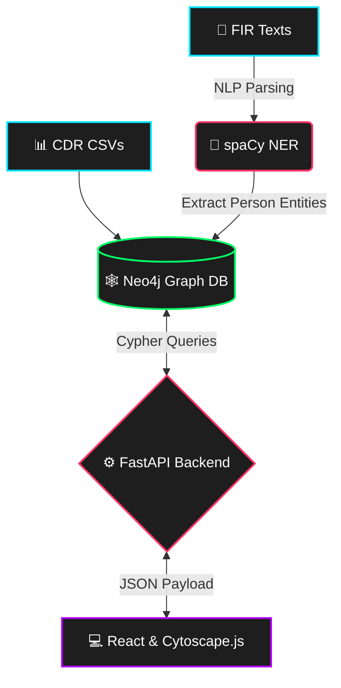

<div align="center">
  <!-- You can replace the src below with an actual GIF/Logo of your project -->
  

  # 🕸️ Nexus Squad Intelligence
  **AI-Powered Criminal Network Analysis & Kingpin Detection**
  
  *Built by Team Nexus Sqad*

  <!-- Dynamic Shields.io Badges -->
  <p align="center">
    
    
    
    
    
    
  </p>
  
  <p align="center">
    <a href="#overview">Overview</a> • 
    <a href="#system-architecture">Architecture</a> • 
    <a href="#key-features">Features</a> • 
    <a href="#getting-started">Run Locally</a> • 
    <a href="#api-docs">API Docs</a>
  </p>
</div>

---

## 🚨 Overview: The Problem & Solution

Law enforcement agencies drown in raw data. Manually cross-referencing thousands of structured **Call Detail Records (CDRs)** with unstructured **First Information Reports (FIRs)** to find a common suspect takes months. 

**Nexus Squad Intelligence** changes the game. It bridges the gap by autonomously reading English FIR texts using a `spaCy` NLP pipeline, extracting suspect identities, and injecting them into a high-speed `Neo4j` Graph Database alongside telecom data. The result? A physics-based, interactive topology dashboard that calculates network influence in real-time, instantly flagging the central "Kingpin." 

Months of manual reading transformed into **minutes of actionable intelligence**.

---

## ⚡ System Architecture (The Engine)

Our architecture is fully decoupled, ensuring extreme speed and modularity.


---------------------------------------------------------------

---

## 🎯 Key Features & Impact

*   **🛡️ Automated Entity Extraction:** The NLP engine (`en_core_web_sm`) autonomously scans unstructured police narratives to identify suspects and directly links them to specific FIRs.
*   **🕸️ Multi-Hop Graph Traversal:** Replaces flat RDBMS tables with Neo4j. `CALLED`, `OWNS`, and `SUSPECT_IN` edges map out syndicates natively.
*   **📡 Mathematical Kingpin Detection:** Executes *Degree Centrality* algorithms at the database level to flag the most influential nodes and middlemen, replacing human guesswork.
*   **💻 Cyber-Intelligence UI:** A zero-latency React SPA utilizing Cytoscape.js. Suspects tagged in FIRs are aggressively highlighted as red hexagons for instant threat recognition.

---

## 🚀 Getting Started (Run Locally)

Want to run the intelligence grid on your local machine? Follow these steps.

### Prerequisites
*   Python 3.10+
*   Node.js v18+
*   Neo4j Desktop / Community Edition

### 1. Start the Graph Database
Start your local Neo4j instance and ensure the credentials match the `.env` file in the backend.
```bash
sudo systemctl start neo4j
```

### 2. Boot up the Backend (FastAPI)
Open Terminal 1:
```bash
cd backend
python3 -m venv venv
source venv/bin/activate
pip install -r requirements.txt
python3 -m spacy download en_core_web_sm  # Download the NLP model
python3 -m uvicorn main:app --reload
```

### 3. Launch the Frontend Dashboard (React)
Open Terminal 2:
```bash
cd frontend
npm install
npm start
```
*The NEXUS SQAD dashboard will automatically launch at `http://localhost:3000`.*

---

## 📚 Interactive API Documentation

Because we built the backend using FastAPI, the project ships with out-of-the-box OpenAPI documentation. 

Once the backend is running, navigate to:
👉 **`http://127.0.0.1:8000/docs`**

Here, you can test the Cypher queries, view the Pydantic schemas (e.g., `KingpinResponse`), and interact with the endpoints without touching the frontend.

---

<div align="center">
  <p><b>"Striking the root, not the leaves."</b></p>
  <i>Conceptualized for Smart India Hackathon (SIH) 2026</i><br>
  <i>NEXUS SQAD</i>
</div>
